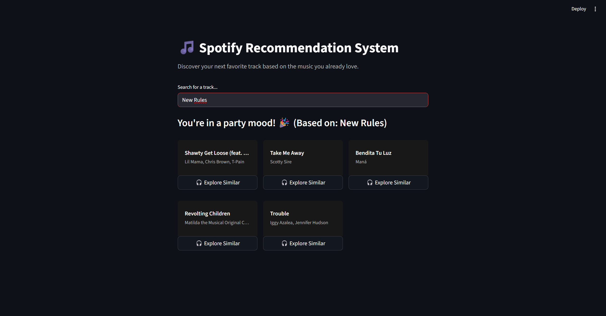

# Spotify Recommendation System

Spotify Recommendation System is a music recommendation app built as my first ML project -
starting from raw audio data and ending with a working browser interface.

## What it does

You enter a song name and the website gives you 5 similar tracks. Recommendations are scoped within 
taste clusters, so results stay sonically coherent rather than just statistically close.

## Why I built this

I wanted to see if I could take something abstract, such as numerical audio features 
like danceability or valence, and turn them into something a computer 
could meaningfully group and compare.

## Approach

**1. Feature selection**  
I used 5 audio features from the Spotify dataset: danceability, energy, 
valence, loudness, and tempo. These capture the "feel" of a track better 
than metadata like key or speechiness.

**2. Clustering**  
Applied KMeans (k = 5) on StandardScaler-normalised data. Rather than leaving 
clusters as 0–4, I interpreted the mean feature values for each group and 
named them manually:

| Cluster | Name | Signal |
|---------|------|--------|
| 0 | Party | High danceability, high valence |
| 1 | Workout | High energy, low valence |
| 2 | Chill | Low energy, low loudness |
| 3 | Balanced | Mid-range across all features |
| 4 | Energetic | High tempo, high energy |

This is the step where the project stops being ML and starts being a product.

**3. Similarity scoring**  
Within each cluster, tracks are ranked using cosine similarity. 
I chose cosine over Euclidean distance after learning the difference: 
Euclidean measures raw distance between values, while cosine measures 
the angle between vectors, so whether two tracks have a similar profile 
regardless of intensity. For music, that distinction matters.

**4. Interface**  
Streamlit app with card-based results and a drill-down button to explore 
from any recommended track.

## Tech stack

Python, pandas, scikit-learn, Streamlit

## Limitations

- Static dataset - no live Spotify API integration
- KMeans uses hard cluster boundaries, in practice Workout and Party 
  overlap significantly, which a fuzzy clustering approach would handle better
- No user listening history - recommendations are feature-based only

## Next steps

- Spotify API integration for real-time data
- Collaborative filtering layer
- User history as input signal

## Tools & Process

Core logic built manually in Python - clustering, similarity scoring, 
recommendation function. The UI layer was built with AI-assisted tools
to accelerate development, allowing focus on the underlying system design
and machine learning logic.
